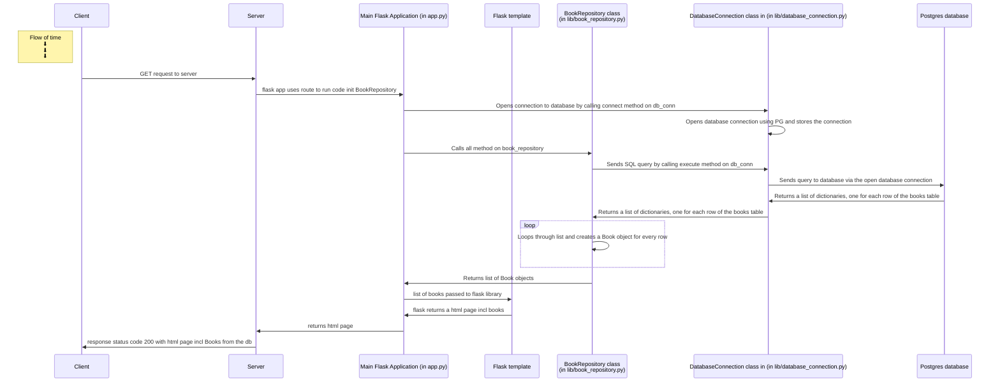

```mermaid
sequenceDiagram
    participant c as Client
    participant s as Server
    participant app as Main Flask Application (in app.py)
    participant flask as Flask template
    participant ar as BookRepository class <br /> (in lib/book_repository.py)
    participant db_conn as DatabaseConnection class in (in lib/database_connection.py)
    participant db as Postgres database

    Note left of c: Flow of time <br />⬇ <br /> ⬇ <br /> ⬇ 

    c->>s: GET request to server
    s->>app: flask app uses route to run code init BookRepository
    app->>db_conn: Opens connection to database by calling connect method on db_conn
    db_conn->>db_conn: Opens database connection using PG and stores the connection
    app->>ar: Calls all method on book_repository
    ar->>db_conn: Sends SQL query by calling execute method on db_conn
    db_conn->>db: Sends query to database via the open database connection
    db->>db_conn: Returns a list of dictionaries, one for each row of the books table

    db_conn->>ar: Returns a list of dictionaries, one for each row of the books table
    loop 
        ar->>ar: Loops through list and creates a Book object for every row
    end
    ar->>app: Returns list of Book objects
    app->>flask: list of books passed to flask library
    flask->>app: flask returns a html page incl books
    app->>s: returns html page
    s->>c: response status code 200 with html page incl Books from the db
```
