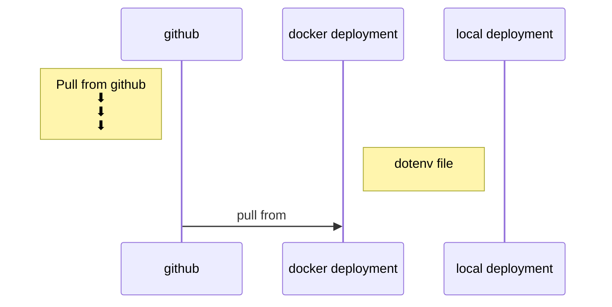

```mermaid
sequenceDiagram
    participant g as github
    participant dckr as docker deployment
    participant lcl as local deployment

    Note left of g: Pull from github <br />⬇ <br /> ⬇ <br /> ⬇ 
    Note right of dckr: dotenv file <br /> 

    g->>dckr: pull from 

```
